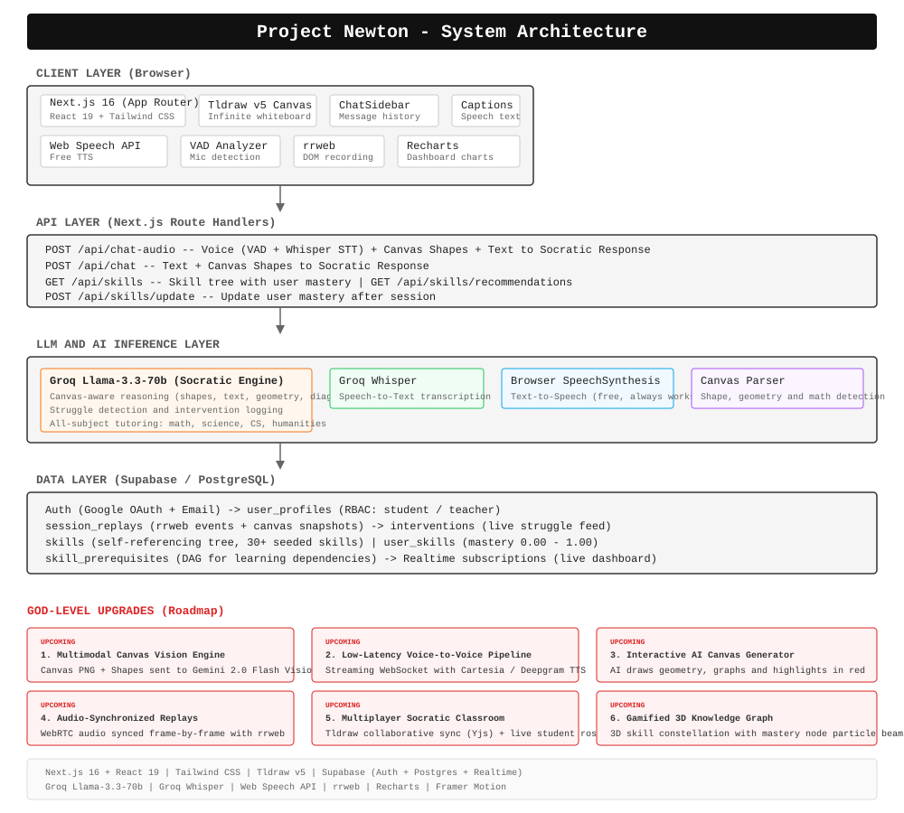

<p align="center">
  <picture>
    <source media="(prefers-color-scheme: dark)" srcset="https://images.unsplash.com/photo-1620712943543-bcc4688e7485?q=80&w=1200&auto=format&fit=crop">
    
  </picture>
</p>

<h1 align="center">Project Newton -- The Cognitive AI Tutor</h1>

<p align="center">
  <em>The world's first open-source Socratic AI co-pilot with real-time voice and spatial canvas intelligence</em>
</p>

<p align="center">
  <a href="#-why-newton"></a>
  <a href="#-quick-start"></a>
  <a href="PRD.md"></a>
  <a href="public/newton-architecture.excalidraw"></a>
</p>

<p align="center">
  
  
  
  
  
  
  
</p>

---

## Table of Contents

- [Why Newton?](#why-newton)
- [The Problem We Solve](#the-problem-we-solve)
- [Architecture](#architecture)
- [Quick Start](#quick-start)
- [Features Deep Dive](#features-deep-dive)
- [Project Structure](#project-structure)
- [How the Socratic Engine Works](#how-the-socratic-engine-works)
- [Tech Stack and Rationale](#tech-stack-and-rationale)
- [Market Landscape](#market-landscape)
- [Roadmap](#roadmap)
- [God-Level Upgrades](#god-level-upgrades)
- [Contributing](#contributing)
- [License](#license)

---

## Why Newton?

> **"It does not give answers. It guides students to the 'Aha!' moment."**

Newton is a venture-grade, open-source AI tutoring platform that merges real-time voice interaction with a spatial digital canvas. Built for students who need more than a chatbot -- they need a thinking partner that sees what they draw, hears what they say, and asks the right Socratic question to unlock understanding.

**Unlike every other open-source AI tutor, Newton is not a CLI tool or a chat widget.** It is a complete spatial learning environment:

| Capability | What It Does |
|------------|-------------|
| **Voice-First** | Browser-native speech recognition and synthesis -- 100% free, zero latency |
| **Infinite Canvas** | Draw math, diagrams, or code. The AI sees your shapes in real-time. |
| **Socratic by Design** | Purpose-built prompt engineering that never hands out answers |
| **Teacher Dashboard** | Live heatmaps, real-time intervention alerts, full cognitive replay |
| **Session Replay** | Every canvas interaction recorded via rrweb for breakthrough analysis |
| **Chat and Captions** | Full chat sidebar with AI conversation history and animated speech captions |

---

## The Problem We Solve

### The AI Tutor Crisis (Stanford Study, June 2026)

A recent Stanford randomized controlled trial across approximately 350 elementary students found a sobering truth:

> **Giving students access to an AI tutor does not mean they will use it.**

The current generation of AI tutors fails because:

1. **They are chat-only** -- No spatial/visual interaction, just text in a box
2. **They answer too quickly** -- Students copy answers instead of learning
3. **They do not integrate with how students actually work** -- Paper, whiteboards, diagrams
4. **Teachers are blind** -- No visibility into who is struggling, with what, and why

Newton was designed from day one to solve all four problems -- by combining voice, canvas, Socratic method, and a full teacher observation layer.

---

## Architecture

> **View the interactive Excalidraw diagram:** [`public/newton-architecture.excalidraw`](public/newton-architecture.excalidraw)
> *(Open with [excalidraw.com](https://excalidraw.com) or the VS Code Excalidraw extension)*

<p align="center">
  
</p>

### Architecture Decisions

| Decision | Why |
|----------|-----|
| **Browser Web Speech instead of LiveKit** | 100% free, zero latency, no infrastructure, works on Chromebooks |
| **Groq Llama-3.3-70b** | 800+ tok/sec inference for real-time Socratic dialogue |
| **Tldraw v5 instead of custom canvas** | Battle-tested infinite canvas with rich shape API and JSON serialization |
| **Next.js API Routes (no separate backend)** | Deploy entire platform to Vercel in one click |
| **Supabase Realtime** | Live teacher dashboard without WebSocket infrastructure costs |
| **rrweb for replays** | Full DOM recording without complex video storage, works offline |
| **CSS Grid instead of absolute positioning** | No z-index conflicts, no hidden UI elements, responsive by default |

---

## Quick Start

### Prerequisites

- Node.js 18+
- A Groq API key ([Get one free](https://console.groq.com/))
- (Optional) A Supabase project ([supabase.com](https://supabase.com)) for auth and persistence

### 1. Clone and Install

```bash
git clone https://github.com/shashank-tomar0/ai-tutor.git
cd ai-tutor
npm install
```

### 2. Configure Environment

```bash
cp .env.example .env.local
```

Edit `.env.local`:

```env
# Required -- Groq for LLM + Whisper STT
GROQ_API_KEY=gsk_your_groq_api_key_here

# Required for Supabase Auth + Database + Realtime
NEXT_PUBLIC_SUPABASE_URL=https://your-project.supabase.co
NEXT_PUBLIC_SUPABASE_ANON_KEY=your_anon_key_here
```

### 3. Database Setup

Run `supabase_schema.sql` in your Supabase SQL Editor to create all tables and seed 30+ skills:

```sql
-- Copy and paste the entire supabase_schema.sql file into Supabase SQL Editor
-- This creates: user_profiles, session_replays, skills, user_skills,
--               skill_prerequisites, interventions
```

### 4. Run

```bash
npm run dev
```

Open **[http://localhost:3000](http://localhost:3000)**.

### 5. Try the Full Flow

```
1. Landing Page  ->  Click "START A SESSION" or navigate to /classroom
2. Login         ->  Supabase Auth (Google OAuth)
3. Role Select   ->  Pick "Student" or "Teacher"
4. Classroom     ->  Draw something on the canvas
5. Type in chat  ->  "Solve this equation" or "Teach me React"
6. AI responds   ->  Chat message + writes on canvas + speaks + captions
7. Dashboard     ->  Login as teacher at /dashboard to see interventions + replays
```

---

## Features Deep Dive

### 1. The Sensory Canvas (`/classroom`)

An infinite digital whiteboard where students draw, write, and explore with Newton watching.

**What Newton sees on the canvas:**
```
Canvas Analysis:
- Shapes: 5 total (2 text, 1 rectangle, 1 arrow, 1 line)
- Text content: "2x + 3 = 7" | "Solve for x"
- Geometry: Rectangle at (100, 50) sized 200x150px
- Connections: Arrow from (200, 125) to (400, 125)
- Diagram type: Algebraic equation
```

**Key features:**
- Tldraw infinite canvas with full drawing tools
- Canvas Parser engine detects shapes, geometry, math equations, coordinate planes, flowcharts
- AI writes explanations directly on the canvas as text shapes
- rrweb session recording captures every interaction for replay

### 2. AI Chat and Captions (`ChatSidebar` + `CaptionsBar`)

A full conversational interface built into the classroom:

| Component | Purpose |
|-----------|---------|
| **ChatSidebar** (420px right panel) | Message history, text input, session controls, voice mode selector |
| **CaptionsBar** (overlay at canvas bottom) | Animated word-by-word captions synced with TTS audio |

**Message types:**
- **User messages** -- Right-aligned, black background, white text, with timestamp
- **AI messages** -- Left-aligned, brain icon, "Newton" label, brutalist border design
- **Typing indicator** -- Animated dots during AI processing

**Voice modes:**
| Mode | Backend | Quality | Cost |
|------|---------|---------|------|
| Human | Browser SpeechSynthesis | OS-dependent | Free |
| Native | Browser SpeechSynthesis | OS-dependent | Free |
| Mute | Silent | -- | Free |

### 3. Teacher Cognitive Dashboard (`/dashboard`)

An RBAC-protected control center for educators to monitor classroom cognitive health in real-time.

| Panel | Function | Technology |
|-------|----------|------------|
| **Concept Mastery Heatmap** | Bar chart showing which concepts students struggle with most | Recharts |
| **Live Interventions Feed** | Real-time stream of struggling students and the Socratic prompt used | Supabase Realtime |
| **Cognitive Replays** | Full interactive canvas playback with teacher feedback form | rrweb-player |

**RBAC Flow:**
```
Login -> Supabase Auth -> user_profiles.role check
  -> "student" -> /classroom
  -> "teacher" -> /dashboard (with localStorage fallback)
```

### 4. Aha! Replays (`/replay/[id]`)

Every time Newton detects a cognitive breakthrough, the entire session (DOM mutations via rrweb) is serialized and stored.

**Teacher workflow:**
1. Student completes a session
2. rrweb events compressed and saved to Supabase (or local JSON fallback)
3. Teacher opens replay from dashboard
4. Full canvas reconstruction with playback controls
5. Teacher adds evaluation notes, saved to Supabase (or localStorage fallback)

---

## Project Structure

```
src/
  app/
    page.tsx                 # Landing page (brutalist design)
    layout.tsx               # Root layout with fonts
    globals.css              # Tailwind + global styles

    classroom/
      page.tsx               # Main app: Canvas + Chat + Voice + Captions

    dashboard/
      page.tsx               # Teacher analytics (heatmap, interventions, replays)

    login/
      page.tsx               # Supabase Auth (Google OAuth + Email)
      role-select/
        page.tsx             # Student vs Teacher role picker

    replay/
      page.tsx               # Local JSON file upload viewer
      [id]/
        page.tsx             # Cloud replay + teacher feedback

    api/
      chat/route.ts          # Text + canvas to Groq Socratic engine
      chat-audio/route.ts    # Voice (Whisper STT) + canvas to Groq
      tts/route.ts           # TTS endpoint (client-side SpeechSynthesis)
      skills/
        route.ts             # GET skill tree with user progress
        recommendations/route.ts  # Smart next-skill algorithm
        update/route.ts      # POST update mastery after session
      dashboard/
        struggling/route.ts  # Interventions endpoint
        heatmap/route.ts     # Concept mastery endpoint

  components/
    ChatSidebar.tsx           # Full chat panel (messages + input + controls)
    CaptionsBar.tsx           # Animated speech captions overlay

  utils/
    supabase.ts              # Supabase client initialization
    skill-engine.ts          # Recommendation algorithm + mastery helpers
    canvas-parser.ts         # Deep canvas analysis (shapes, geometry, math)
```

---

## How the Socratic Engine Works

### The Pipeline

```
Student types/speaks -> Canvas JSON serialized -> Shape analysis via Canvas Parser
  -> Groq Llama-3.3-70b with JSON schema enforcement
  -> { is_struggling, concept, response_text }
  -> AI response: Chat message + Canvas text shapes + TTS voice + Captions
  -> If struggling -> Intervention logged to Supabase Realtime -> Teacher dashboard
```

### Prompt Architecture

Newton's system prompt intelligently adapts to whatever the student asks:

> *"The student picks the topic -- follow their lead. If they ask about React, teach React. Read everything on the canvas: text, shapes, diagrams, freehand sketches. Explain clearly. Use analogies. Break it down. Only use Socratic questioning when genuinely stuck. Be warm, conversational, simple."*

### Canvas Parser Intelligence

The `canvas-parser.ts` engine detects:

| Shape | Detection |
|-------|-----------|
| Text or sticky notes | Content extraction |
| Geometric shapes | Type, dimensions, position |
| Arrows | Start/end points, connections |
| Lines | Straight, curved, horizontal/vertical, wavy |
| Freehand draw | Stroke count, segment analysis |
| **Diagrams** | Math equations, coordinate planes, tables, flowcharts, geometric figures |

### Example Interaction

```
Student draws: Right triangle with sides "3", "4", "?"
Student types: "I can't find the hypotenuse"

Newton sees: Canvas has triangle + 3 text labels
Newton analyzes: Student is struggling with Pythagorean Theorem
Newton responds: "I see you've labeled two sides of your right triangle.
  You know the legs are 3 and 4. What relationship connects the three sides
  of a right triangle?"
```

---

## Tech Stack and Rationale

| Technology | Purpose | Why This One |
|-----------|---------|-------------|
| **Next.js 16** | Full-stack framework | App Router, API routes, React 19, Vercel deploy |
| **React 19** | UI library | Concurrency, latest ecosystem |
| **Tailwind CSS** | Styling | Utility-first, fast iteration |
| **Tldraw v5** | Infinite canvas | Battle-tested, rich shape API, JSON serialization |
| **Groq SDK** | LLM inference | 800+ tok/s on Llama-3.3-70b |
| **Supabase** | Auth + DB + Realtime | PostgreSQL, instant APIs, realtime subscriptions |
| **rrweb** | Session replay | Full DOM recording, no video infra |
| **Web Speech API** | STT + TTS | 100% free, browser-native, zero infrastructure |
| **Canvas Parser** | Shape analysis | Custom engine for geometry, math, diagram detection |
| **Recharts** | Charts | Dashboard concept mastery heatmaps |
| **Framer Motion** | Animations | Production-ready animation library |

---

## Market Landscape

### Open-Source AI Tutor Comparison

| Project | Canvas | Voice | Socratic | Replays | Dashboard | Open Source |
|---------|--------|-------|----------|---------|-----------|-------------|
| **Newton** | Yes - Tldraw v5 | Yes - VAD+Whisper | Yes - Enforced | Yes - rrweb | Yes - Realtime | Yes - MIT |
| Khanmigo | No | No | Partial | No | No | No |
| Socra | No | No | Yes | No | No | No |
| MathGPT.ai | No | No | No | No | Yes | No |
| Socratic (Google) | No | Yes - Text only | No | No | No | No |
| DeepTutor | No | No | Yes - Academic | No | No | Yes |

### Competitive Edge

> **Newton is the only open-source AI tutor that combines an infinite whiteboard, real-time voice interaction, Socratic methodology, teacher analytics dashboard, and full session replay -- all deployable to Vercel in one click.**

---

## Roadmap

### Tier 0: v1.0 MVP (Shipped)

| Feature | Status |
|---------|--------|
| Socratic Engine with canvas context | Done |
| Tldraw v5 infinite canvas | Done |
| Voice VAD + Groq Whisper STT | Done |
| Browser SpeechSynthesis (free TTS) | Done |
| ChatSidebar + CaptionsBar | Done |
| AI writes explanations to canvas | Done |
| Teacher Dashboard (heatmap + interventions + replays) | Done |
| rrweb session replay + teacher feedback | Done |
| Supabase Auth + RBAC | Done |
| Adaptive skill tree (30+ skills, prerequisites, mastery) | Done |
| Canvas Parser (shape/geometry/math detection) | Done |
| Excalidraw architecture diagram | Done |
| Comprehensive PRD | Done |

### Tier 1: Next -- High Impact

| Feature | Effort | Impact |
|---------|--------|--------|
| Connect real DB to dashboard APIs | 1 day | High |
| Student Progress Dashboard (streaks, timeline, badges) | 3 days | High |
| Session Summary Modal on end | 1 day | Medium |
| Fix skill context injection in prompts | 0.5 day | High |
| Real user names in interventions | 0.5 day | Medium |
| Multi-subject skill trees (Physics, Chem, Bio, CS) | 1 week | Medium |

### Tier 2: Growth

| Feature | Effort |
|---------|--------|
| Multiplayer classrooms (Yjs + WebSocket) | 2 weeks |
| OpenRouter TTS (premium voice) | 1 day |
| Dark mode + accessibility | 3 days |
| Parent portal (weekly digest) | 1 week |
| Curriculum alignment (Common Core, CBSE, GCSE) | 1 week |

### Tier 3: Scale

| Feature | Effort |
|---------|--------|
| LMS integrations (Google Classroom, Canvas) | 3 weeks |
| Offline-first PWA | 3 weeks |
| Mobile native (React Native / Expo) | 3 weeks |
| Fine-tuned Socratic model | 2 weeks |
| Enterprise admin dashboard | 2 weeks |

---

## God-Level Upgrades

These architectural upgrades represent the next evolutionary leap for Newton:

```
+--------------------------------------------------------------------+
|                    NEWTON GOD-LEVEL ARCHITECTURE                     |
+--------------------------------------------------------------------+
|                                                                      |
|  1. MULTIMODAL CANVAS VISION ENGINE                                  |
|     - Send high-res Canvas PNG snapshot + Vector JSON to Gemini 2.0 |
|     - Understands hand-drawn diagrams, handwritten math, geometry    |
|                                                                      |
|  2. ULTRA-LOW LATENCY VOICE PIPELINE (<600ms)                       |
|     - Streaming WebSocket Audio Pipeline (Cartesia / Deepgram)       |
|     - Live audio waveform visualizer and interrupt handling          |
|                                                                      |
|  3. INTERACTIVE AI CANVAS GENERATOR                                  |
|     - AI draws geometry, plots graphs, highlights mistakes in red    |
|     - Response format emits canvas actions: draw_grid, plot_line     |
|                                                                      |
|  4. AUDIO-SYNCHRONIZED REPLAYS                                       |
|     - Record WebRTC audio synced frame-by-frame with rrweb           |
|     - Teachers hear student's voice and hesitation at exact moment   |
|                                                                      |
|  5. MULTIPLAYER SOCRATIC CLASSROOM                                   |
|     - Tldraw Collaborative Sync (Yjs + WebSockets)                   |
|     - Teacher live-spectates 30 student canvases simultaneously      |
|                                                                      |
|  6. GAMIFIED 3D KNOWLEDGE GRAPH                                      |
|     - 3D Interactive Skill Constellation (Three.js / React Flow)     |
|     - Glowing mastery nodes with dependency particle beams           |
|                                                                      |
+--------------------------------------------------------------------+
```

---

## Contributing

We believe the future of education is open source. Contributions of all kinds are welcome:

| Type | How |
|------|-----|
| **Bug report** | [Open an issue](https://github.com/shashank-tomar0/ai-tutor/issues) |
| **Feature idea** | Check the PRD, then start a discussion |
| **Code** | Pick anything from Tier 1, 2, or God-Level above |
| **Documentation** | Better docs, tutorials, examples always appreciated |

### Development Setup

```bash
npm run dev       # Start dev server at localhost:3000
npm run build     # Production build
npm run lint      # Code quality
```

---

## License

**MIT** -- Because education should be accessible to everyone.

---

<p align="center">
  <strong>Built for the future of learning.</strong><br>
  <em>Newton does not give answers. It creates thinkers.</em>
</p>

<p align="center">
  <a href="#why-newton">Back to top</a>
</p>
