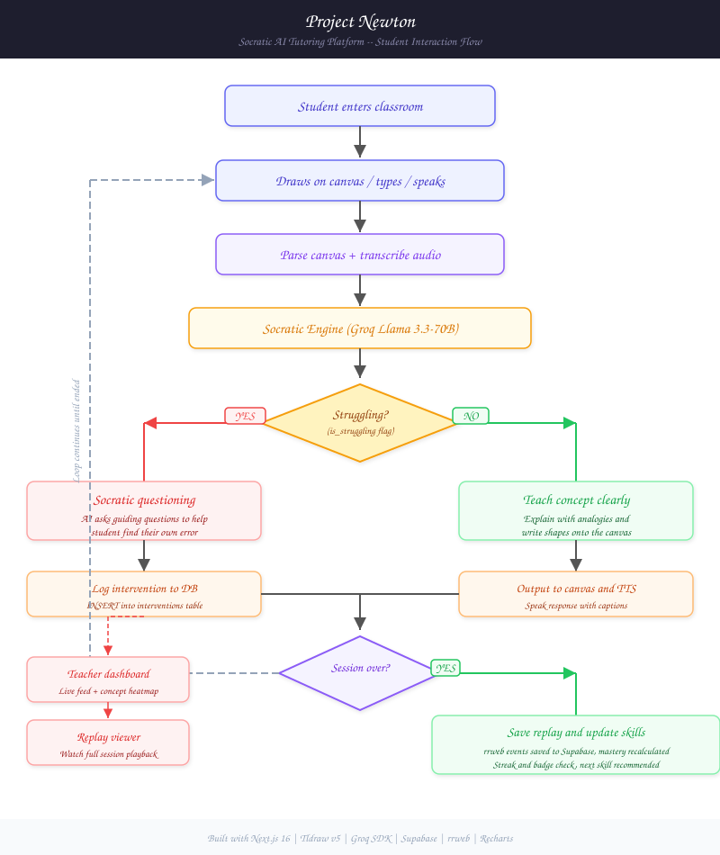

# Project Newton

**A Socratic AI tutoring platform with real-time voice interaction, spatial canvas intelligence, and teacher visibility.**

Project Newton is an open-source cognitive AI tutoring platform that combines an infinite digital whiteboard (Tldraw v5), real-time voice interaction (WebRTC VAD + Groq Whisper), a Socratic reasoning engine (Groq Llama-3.3-70B), teacher analytics, and full session replay (rrweb) into a single deployable Next.js 16 application.

<p align="center">
  
</p>

<p align="center">
  <a href="#quick-start"></a>
  <a href="#features"></a>
  <a href="#api-reference"></a>
  <a href="PRD.md"></a>
</p>


<p align="center">
  
  
  
  
  
  
  
  
</p>

---

## Table of Contents

- [Why Newton](#why-newton)
- [Architecture](#architecture)
  - [Client Layer](#client-layer)
  - [API Layer](#api-layer)
  - [LLM and AI Layer](#llm-and-ai-layer)
  - [Data Layer](#data-layer)
- [Features](#features)
  - [Spatial Canvas Classroom](#spatial-canvas-classroom)
  - [Socratic Engine](#socratic-engine)
  - [Voice Pipeline](#voice-pipeline)
  - [Teacher Dashboard](#teacher-dashboard)
  - [Session Replay](#session-replay)
  - [Adaptive Skill Tree](#adaptive-skill-tree)
- [Quick Start](#quick-start)
  - [Prerequisites](#prerequisites)
  - [Installation](#installation)
  - [Database Setup](#database-setup)
  - [Running the Application](#running-the-application)
- [Project Structure](#project-structure)
- [API Reference](#api-reference)
- [Database Schema](#database-schema)
- [Socratic Engine Architecture](#socratic-engine-architecture)
- [Roadmap](#roadmap)
- [Contributing](#contributing)
- [License](#license)

---

## Why Newton

A June 2026 Stanford randomized controlled trial across 350 elementary students reached a sobering conclusion: giving students access to an AI tutor does not mean they will use it. The study found that engagement, not access, is the binding constraint. Students need a reason to return, a sense of progression, and a modality that matches how they naturally work.

Current AI tutors fail in four fundamental ways.

**They are chat-only.** Chat interfaces cannot represent spatial information. A student drawing a geometry problem or an algebraic equation has no way to show their work. The tutor cannot see the diagram, the labeled sides, or the partial attempt. This forces the student to describe in words what would be obvious in a drawing, creating friction that discourages use.

**They answer too quickly.** The standard chat paradigm optimizes for response speed. When a student asks for help, the model provides the answer. The student copies it and moves on. No learning occurs. The engagement looks good in analytics, but comprehension does not improve.

**They do not fit into how students work.** Students use paper, whiteboards, notebooks, and scratch paper. They draw, annotate, erase, and redraw. A text-only chat interface does not accommodate this workflow.

**Teachers are blind.** Even when students do use AI tutors, teachers have no visibility into the process. They do not know who struggled, with which concept, or what the tutor said. They cannot identify which students had a breakthrough and which ones copied the answer.

Newton addresses all four problems with a single architecture centered on the spatial canvas.

---

## Architecture

The system is organized into four layers, each communicating through well-defined interfaces.

<p align="center">
  
</p>


### Client Layer

The frontend runs Next.js 16 with React 19 and Tailwind CSS. The primary interface is the classroom page, which presents a two-column layout with a Tldraw v5 infinite whiteboard on the left and a 400px chat sidebar on the right.

**Canvas (Tldraw v5).** The infinite whiteboard supports the full drawing toolset: text, rectangles, ellipses, diamonds, triangles, arrows, lines, freehand drawing, sticky notes, and image imports. Shapes are serialized to JSON and sent with every AI request. A custom Canvas Parser engine (397 lines, `src/utils/canvas-parser.ts`) analyzes the shape tree before each request, producing a structured description that includes:

- Shape type counts and total count
- Extracted text content from text and sticky shapes
- Geometric shape descriptions (type, position, dimensions)
- Arrow connection tracing (start to end coordinates)
- Line classification (straight horizontal, vertical, diagonal, curved, wavy)
- Freehand stroke segment counts
- Higher-level diagram type detection (algebraic equation, coordinate plane, table, flowchart, geometric figure, freehand sketch)

**ChatSidebar.** The chat interface provides message history with user messages right-aligned on black backgrounds and AI messages left-aligned with a brain icon. A typing indicator animates during AI processing. Voice controls toggle between Human Voice (OpenRouter TTS via Audio element), System Voice (browser SpeechSynthesis), and Mute. A session start/end button controls the voice activity detection pipeline.

**CaptionsBar.** An animated word-by-word caption overlay synchronized with audio playback, positioned at the bottom of the canvas area. The component handles three voice modes with distinct visual indicators.

**Additional components.** The SkillTreeSidebar provides a collapsible modal for browsing and selecting skills, with prerequisite enforcement that greys out locked skills until requirements are met. The SessionSummaryModal displays mastery delta, duration, and struggle metrics when a session ends. The HandwritingModal provides a dedicated scratchpad for drawing equations and sending them for OCR-based AI solving via a two-phase pipeline (vision OCR then Socratic LLM).

### API Layer

All server-side logic is implemented as Next.js App Router route handlers within the same project. Each route follows a consistent pattern: request validation, external API calls (Groq, Supabase, OpenRouter), structured JSON response.

| Endpoint | Method | Purpose |
|----------|--------|---------|
| `/api/chat-audio` | POST | Accepts audio blobs (via FormData) or text, transcribes with Groq Whisper, sends to Socratic engine, returns JSON with text and canvas content |
| `/api/chat` | POST | Accepts JSON with transcript and shapes, sends to Socratic engine, returns JSON response |
| `/api/tts` | POST | Proxies text to OpenRouter TTS API, returns MP3 audio stream, falls back to JSON indicating browser fallback |
| `/api/skills` | GET | Returns skill tree with optional user progress merged, supports subject filtering |
| `/api/skills/recommendations` | GET | Returns ranked list of recommended next skills based on prerequisites, mastery, recency, and gateway value |
| `/api/skills/update` | POST | Updates user skill mastery with compounding formula |
| `/api/dashboard/heatmap` | GET | Returns concept mastery data aggregated from user_skills and interventions |
| `/api/dashboard/struggling` | GET | Returns recent intervention records for the live teacher feed |
| `/api/progress` | GET | Returns student streak, weekly goal progress, and last session data |

### LLM and AI Layer

**Socratic Engine (Groq Llama-3.3-70B Versatile).** The core reasoning engine runs on Groq's infrastructure at over 800 tokens per second, enabling real-time conversational dialogue. The system prompt instructs the model to:

- Follow the student's lead on topic selection
- Read everything on the canvas before responding
- Explain concepts using analogies and worked examples
- Use Socratic questioning only when the student is genuinely stuck
- Respond exclusively in JSON format: `{ "is_struggling": boolean, "concept": string, "response_text": string, "canvas_content": array | null }`

**Multimodal Vision (Fallback).** When canvas image data is available (via `captureCanvasImage`), the API switches to `llama-3.2-11b-vision-instruct` for multimodal reasoning. This enables handwriting OCR, diagram interpretation, and handwritten math recognition.

**Speech-to-Text (Groq Whisper).** Audio captured through the browser MediaRecorder API is transcribed using Groq Whisper's `whisper-large-v3` model. The VAD pipeline uses Web Audio API's `AnalyserNode` with `fftSize=512`, computing average frequency amplitude and triggering recording above a threshold of 15 (on a 0-255 scale) with a silence timeout of 1,500ms.

**Text-to-Speech (OpenRouter + Browser Fallback).** The Human Voice mode fetches MP3 audio from OpenRouter's TTS API (OpenAI TTS-1 model) and plays it through a standard HTML Audio element. This approach avoids a known Chrome bug where `window.speechSynthesis` silently drops audio through non-default output devices (headphones, Bluetooth headsets). The System Voice mode uses browser `SpeechSynthesis` with a pre-speak AudioContext ping workaround for improved device compatibility. Mute mode disables all audio output.

### Data Layer

**Supabase PostgreSQL.** Six database tables store all application data with Row-Level Security enabled:

- `user_profiles`: Authentication profiles with RBAC (student/teacher roles)
- `session_replays`: rrweb event data and canvas snapshots with teacher feedback
- `skills`: Self-referencing tree (30 skills across 7 root subjects)
- `skill_prerequisites`: Directed acyclic graph for learning dependencies
- `user_skills`: Per-user mastery tracking with recency and attempt counts
- `interventions`: Real-time struggle detection feed for teachers

**Supabase Auth.** Google OAuth 2.0 authentication with automatic profile creation on first login. Role selection redirects students to `/classroom` and teachers to `/dashboard`.

**Supabase Realtime.** WebSocket-based subscriptions push INSERT events from the `interventions` and `session_replays` tables to connected dashboard clients in real-time, enabling the live teacher feed.

---

## Features

### Spatial Canvas Classroom

The classroom page is the primary student interface. It presents a full-screen two-column grid with the canvas occupying the flexible center area and a 400px chat sidebar on the right. The top bar provides navigation, skill selection, assignment import, handwriting reading, canvas clearing, and a live session status indicator.

When a student types in the chat or speaks through the microphone, the system:

1. Serializes all canvas shapes to JSON.
2. Runs the Canvas Parser to produce a rich textual description.
3. Sends the transcript and canvas description to the Socratic engine.
4. Receives a JSON response containing the struggle flag, concept, response text, and optional canvas drawing commands.
5. Renders the response in the chat sidebar, writes structured shapes onto the canvas at the current viewport position (with automatic stacking and column overflow handling), and speaks the response through TTS with synchronized animated captions.

The classroom also records all DOM interactions via rrweb for later playback. When a session ends, the events are compressed and saved to Supabase. If the database connection fails, the events are downloaded as a local JSON file.

### Socratic Engine

The system prompt is designed to make the model follow the student's lead on topic selection. If the student asks about React, the model teaches React. If the student draws a triangle, the model teaches geometry. If the student writes an equation, the model teaches algebra. The model reads everything on the canvas, explains clearly using analogies, and resorts to Socratic questioning only when the student indicates genuine confusion.

When a student is identified as struggling (`is_struggling: true`), an intervention record is inserted into Supabase, triggering a Realtime push to the teacher dashboard.

### Voice Pipeline

The voice pipeline operates in three modes selectable from the chat sidebar:

- **Human Voice.** Audio is sent to the `/api/tts` endpoint, which proxies the request to OpenRouter's OpenAI TTS-1 model. The returned MP3 is played via a standard HTML Audio element. This mode works correctly with all audio output devices including headphones and Bluetooth headsets.

- **System Voice.** The browser's native `window.speechSynthesis` API handles TTS. A pre-speak AudioContext ping mitigates the long-standing Chrome bug where SpeechSynthesis drops audio through non-default output devices.

- **Mute.** All audio output is disabled. Captions still display so students can read responses.

### Teacher Dashboard

The dashboard is an RBAC-protected panel accessible only to users with the `teacher` role. It presents three panels in a grid layout:

- **Concept Mastery (Panel 01).** A bar chart rendered with Recharts showing concept versus struggle frequency, aggregated from the interventions table.

- **Live Interventions (Panel 02).** A real-time feed displaying struggling students with their name, concept, and exact struggle text. Powered by Supabase Realtime subscriptions listening for INSERT events on the `interventions` table.

- **Cognitive Replays (Panel 03).** A list of all saved sessions with student name, concept, and timestamp. Each entry has a play button that opens the replay player at `/replay/[id]`. If no replays are available, a fallback section links to the manual file upload viewer.

### Session Replay

The replay player reconstructs a recorded canvas session using the rrweb-player library. When a teacher opens a replay by ID, the events are fetched from Supabase and the player renders them with auto-play and full playback controls. The replay page includes metadata (student name, concept, timestamp, duration, struggle count) and a teacher feedback form.

A standalone replay page at `/replay` allows uploading local JSON files for playback when cloud replays are unavailable.

### Adaptive Skill Tree

The database includes 30 seeded skills across 7 root subjects with prerequisite chains forming a directed acyclic graph. The recommendation algorithm scores each unlocked skill based on:

- Current mastery level (lower mastery = higher priority)
- Days since last practice (due for review after 7 days)
- Gateway value (bonus points for skills that unlock others)
- Difficulty tier (easier skills prioritized within same priority band)

The SkillTreeSidebar component displays the full tree as a collapsible hierarchy with color-coded mastery percentages (gray/red/amber/blue/green), subject filter tabs (Math, CS), and a recommended next skill card with reasoning.

---

## Quick Start

### Prerequisites

- Node.js 18 or later
- A Groq API key (free at console.groq.com)
- A Supabase project (free tier at supabase.com)

### Installation

```bash
git clone https://github.com/shashank-tomar0/ai-tutor.git
cd ai-tutor
npm install
```

### Environment Configuration

Create a file named `.env.local` in the project root:

```env
GROQ_API_KEY=gsk_your_groq_api_key
NEXT_PUBLIC_SUPABASE_URL=https://your-project-ref.supabase.co
NEXT_PUBLIC_SUPABASE_ANON_KEY=your_supabase_anon_key
OPENROUTER_API_KEY=sk-or-v1-your_openrouter_key
```

The `OPENROUTER_API_KEY` is optional. When set, the Human Voice mode uses OpenRouter TTS for higher quality audio output. When unset, all voice modes fall back to browser SpeechSynthesis.

### Database Setup

1. Open your Supabase project dashboard.
2. Navigate to the SQL Editor.
3. Open and run the entire contents of `supabase_schema.sql`.
4. This creates all six database tables with indexes, enables Row-Level Security, and inserts 30 seed skills with prerequisite chains.

### Running the Application

```bash
npm run dev
```

Open http://localhost:3000 in your browser.

### Testing the Full Application

1. Open the landing page to view the Newton manifesto, feature grid, and pricing tiers.
2. Navigate to `/classroom`. You will be redirected to the login page.
3. Sign in with Google OAuth through the Supabase Auth UI.
4. Choose "Student" on the role selection screen.
5. The classroom loads with the Tldraw canvas and chat sidebar. Draw an equation or shape.
6. Type a question in the chat input. The AI responds in the chat, writes on the canvas, and speaks with captions.
7. Click START to enable voice mode, then speak a question. The voice is transcribed by Groq Whisper and processed through the same pipeline.
8. End the session. The replay is saved to Supabase (or downloaded as a JSON file).
9. Sign out and sign in again, choosing "Teacher" as the role.
10. Navigate to `/dashboard` to see the intervention feed and replay library.

---

## Project Structure

```
src/
  app/
    page.tsx                     Landing page with brutalist design
    layout.tsx                   Root layout with font loading
    globals.css                  Tailwind and global style definitions

    classroom/page.tsx           Main canvas, chat, voice, and captions interface
    dashboard/page.tsx           Teacher analytics dashboard (RBAC protected)
    login/page.tsx               Supabase Auth UI with Google OAuth
    login/role-select/page.tsx   Student or Teacher role selection
    progress/page.tsx            Student progress dashboard
    replay/page.tsx              Local JSON file upload and playback
    replay/[id]/page.tsx         Cloud replay player with teacher feedback

    api/
      chat/route.ts              Text + canvas to Socratic engine
      chat-audio/route.ts        Voice + canvas to Socratic engine (with vision)
      tts/route.ts               TTS proxy to OpenRouter OpenAI TTS
      skills/route.ts            Skill tree with user progress
      skills/recommendations/    Next skill recommendation engine
      skills/update/             Mastery progress updates
      progress/route.ts          Student streak and weekly goal data
      dashboard/heatmap/         Concept mastery aggregation
      dashboard/struggling/      Live intervention feed

  components/
    ChatSidebar.tsx              Message history, input, session controls, voice selector
    CaptionsBar.tsx              Animated speech captions overlay
    SkillTreeSidebar.tsx         Collapsible skill tree with recommendations and prerequisite enforcement
    SessionSummaryModal.tsx      End-of-session summary modal
    HandwritingModal.tsx         Scratchpad for OCR-based handwritten equation solving

  utils/
    supabase.ts                  Supabase client singleton
    skill-engine.ts              Recommendation algorithm, mastery helpers
    canvas-parser.ts             Shape normalization, diagram classification engine

docs/
  newton-user-flow.excalidraw    Editable user-flow diagram (Excalidraw format)
  newton-user-flow.svg           Rendered user-flow diagram

PRD.md                           Full product requirements document
supabase_schema.sql              Database schema and seed data
```

---

## API Reference

### POST /api/chat-audio

Accept multipart form data with the following fields:

| Field | Type | Required | Description |
|-------|------|----------|-------------|
| file | File | No | Audio blob (webm) for speech-to-text |
| text | string | No | Direct text input (alternative to file) |
| shapes | string (JSON) | Yes | Serialized Tldraw shapes array |
| image | string | No | Base64 PNG of canvas for vision model |
| skill | string (JSON) | No | Selected skill object with id and name |
| user_id | string | No | Supabase auth user ID |
| student_name | string | No | Display name for intervention logging |

At least one of `file` or `text` must be provided.

**Response:**
```json
{
  "type": "ai_response",
  "text": "Great question about solving for x. Here is a hint: what operation would undo the multiplication?",
  "transcript": "How do I solve 3x plus 5 equals 20?",
  "canvas_content": [
    { "type": "box", "text": "Equation: 3x + 5 = 20", "color": "violet", "fill": "semi" },
    { "type": "arrow", "fromIndex": 0, "toIndex": 2, "label": "subtract 5 from both sides" }
  ]
}
```

### POST /api/chat

Accept JSON body:

| Field | Type | Required | Description |
|-------|------|----------|-------------|
| transcript | string | Yes | Student's text message |
| shapes | array | No | Tldraw shapes array |
| skill | object | No | Selected skill context |
| user_id | string | No | Auth user ID |
| student_name | string | No | Display name |

**Response:** Same structure as `/api/chat-audio` (without `transcript` field).

### GET /api/skills

**Query Parameters:**
- `userId` (string, optional): If provided, merges user mastery progress into the tree.
- `subject` (string, optional): Filters skills by subject (e.g., "mathematics", "computer_science").

**Response:**
```json
{
  "skills": [
    {
      "id": "uuid",
      "name": "Arithmetic",
      "subject": "mathematics",
      "difficulty": 1,
      "mastery_level": 0.75,
      "children": [ /* nested skill objects */ ]
    }
  ]
}
```

### GET /api/skills/recommendations

**Query Parameters:**
- `userId` (string, required): The user ID to generate recommendations for.

**Response:**
```json
{
  "recommendation": {
    "skill": { "id": "uuid", "name": "Linear Equations", "icon": "x", "difficulty": 5 },
    "mastery_level": 0,
    "attempts": 0,
    "reason": "Never practiced - start here",
    "unlocks": 3
  },
  "candidates": [
    { "skill": { "id": "uuid", "name": "Fractions", "icon": "cake", "difficulty": 3 }, "score": 95, "reason": "Struggling (20% mastery)" }
  ]
}
```

### POST /api/skills/update

**Request Body:**
```json
{
  "userId": "uuid",
  "skillId": "uuid",
  "success": true
}
```

**Response:**
```json
{
  "mastery_level": 0.42,
  "attempts": 3,
  "successful_attempts": 2,
  "previous_mastery": 0.15
}
```

### POST /api/tts

**Request Body:**
```json
{
  "text": "Hello, let me explain how to solve this equation.",
  "voice": "alloy"
}
```

**Response:** MP3 audio stream (Content-Type: audio/mpeg) on success. Falls back to `{ "fallback": true }` JSON when the API is unavailable.

### GET /api/progress

**Query Parameters:**
- `userId` (string, required): The user ID to fetch progress data for.

**Response:**
```json
{
  "streak": 3,
  "bestStreak": 7,
  "weeklyGoal": 5,
  "weeklyCompleted": 2,
  "lastSession": {
    "date": "2026-07-24T10:30:00Z",
    "skillName": "Linear Equations",
    "masteryGain": 17
  }
}
```

---

## Database Schema

Six tables with Row-Level Security, indexes on foreign keys, and seed data.

```
auth.users (managed by Supabase Auth)
  id UUID PK, email TEXT, created_at TIMESTAMPTZ

user_profiles
  id UUID PK -> auth.users, role TEXT CHECK (student|teacher), name TEXT, created_at TIMESTAMPTZ

session_replays
  id UUID PK, user_id UUID -> auth.users, student_name TEXT, concept TEXT,
  events JSONB, canvas_snapshot JSONB, feedback TEXT, created_at TIMESTAMPTZ

skills (self-referencing tree)
  id UUID PK, name TEXT, subject TEXT, parent_id UUID -> skills,
  difficulty INT (1-10), icon TEXT, order_index INT, description TEXT, timestamps

skill_prerequisites (DAG)
  skill_id UUID PK -> skills, requires_skill_id UUID PK -> skills

user_skills
  id UUID PK, user_id UUID -> auth.users, skill_id UUID -> skills,
  mastery_level NUMERIC(3,2), attempts INT, successful_attempts INT,
  last_practiced TIMESTAMPTZ, UNIQUE (user_id, skill_id)

interventions
  id UUID PK, user_id UUID -> auth.users, student_name TEXT, concept TEXT,
  struggle TEXT, breakthrough TEXT, skill_id UUID -> skills, created_at TIMESTAMPTZ
```

---

## Socratic Engine Architecture

The system prompt given to Groq Llama-3.3-70B is designed for structured JSON output. The key architecture decisions:

**Canvas Injection.** Before every request, the Canvas Parser (`src/utils/canvas-parser.ts`) normalizes all shapes and produces a structured summary. The parser handles Tldraw v5's `richText` format (extracting plain text from the JSON structure), normalizes colors to valid Tldraw values, and detects higher-level diagram types (algebraic equations, coordinate planes, tables, flowcharts, geometric figures, freehand sketches).

**System Prompt Design.** The prompt instructs the model to teach concepts clearly when asked, using both chat and canvas output. It must populate `canvas_content` with structured visual shapes (boxes, circles, arrows, diamonds, clouds, stars, notes) when explaining concepts. For exercises and problems, it uses Socratic questioning to guide students to find their own errors instead of giving away the solution.

**Intervention Flow.** When the model returns `is_struggling: true`, the API inserts a record into the `interventions` table. Supabase Realtime then pushes this event to all connected teacher dashboard clients.

**Multimodal Fallback.** When canvas image data is available (base64 PNG via `exportToBlob`), the API switches from text-only to multimodal by sending the image alongside the text context. The model uses `llama-3.2-11b-vision-instruct` for vision-capable reasoning.

---

## Roadmap

### Tier 0 (Currently Shipped)

- Socratic engine with full canvas context awareness (Groq Llama-3.3-70B)
- Tldraw v5 infinite whiteboard with complete drawing toolset
- Voice activity detection using Web Audio AnalyserNode
- Groq Whisper speech-to-text (whisper-large-v3)
- Dual TTS: OpenRouter (Human Voice) and browser SpeechSynthesis (System Voice) with headphone fix
- Chat sidebar with message history, typing indicator, and session controls
- AI writes structured visual shapes onto the canvas in real-time
- Teacher dashboard with concept heatmap, live intervention feed, and replay library
- rrweb session recording with Supabase storage and JSON fallback
- Supabase authentication with Google OAuth and RBAC (student/teacher)
- Adaptive skill tree with 30 seeded skills across 7 subjects
- Per-user mastery tracking with compounding success formula
- Prerequisite-based skill recommendation algorithm with client-side enforcement
- Canvas parser for shape, geometry, equation, and diagram detection
- Session summary modal on end (mastery delta, duration, struggle count)
- Teacher feedback form on replay viewer
- Handwriting OCR scratchpad with two-phase vision pipeline (OpenRouter + Groq)
- Student progress dashboard with real streak tracking and weekly goals
- Progress API endpoint (GET /api/progress)
- Loading skeleton placeholders on dashboard and skill tree
- User-flow interaction diagram (Excalidraw + SVG)
- Comprehensive product requirements document (PRD.md)

### Tier 1 (In Development)

- Real database integration for dashboard analytics endpoints
- Multi-subject skill trees for physics, chemistry, biology, and programming
- Session memory for conversation context (last 5 Q&A pairs)
- Achievement badges and gamification system
- Multiplayer classrooms with collaborative Tldraw sync

### Tier 2 (Next Quarter)

- Multiplayer classrooms with collaborative Tldraw sync via Yjs and WebSockets
- Teacher can create rooms, generate join codes, and push problems to student canvases
- Dark mode with system preference detection and high-contrast accessibility
- Parent portal with weekly progress digest emails
- Curriculum alignment with Common Core, CBSE, and GCSE standards

### Tier 3 (Future)

- LMS integrations with Google Classroom, Canvas, Schoology, and Powerschool via LTI 1.3
- Offline-first progressive web app with IndexedDB sync queue
- Mobile native applications for iOS and Android with handwriting recognition
- Fine-tuned Socratic model for reduced API costs (self-hosted vLLM)
- Enterprise admin dashboard with multi-school analytics and SSO

### God-Level Upgrades

1. **Multimodal Canvas Vision.** Send canvas PNG snapshots alongside shape JSON to a vision model, enabling the AI to understand handwritten math, hand-drawn diagrams, and geometric angles that pure vector analysis cannot interpret.

2. **Low-Latency Voice Pipeline.** Replace the current request-response voice cycle with a streaming WebSocket pipeline using Cartesia or Deepgram for sub-600ms voice-to-voice interaction with interrupt handling.

3. **Interactive AI Canvas Generator.** Extend the AI response format to emit canvas drawing commands (draw_grid, plot_line, highlight_error, draw_triangle) enabling the AI to illustrate concepts directly on the canvas in real-time.

4. **Audio-Synchronized Replays.** Record WebRTC audio streams alongside rrweb DOM events so teachers can hear a student's voice and hesitation synchronized frame-by-frame with their canvas interactions.

5. **Multiplayer Socratic Classroom.** Implement Tldraw collaborative sync via Yjs and WebSockets, allowing a teacher to spectate up to 30 student canvases simultaneously and push problems to all students at once.

6. **Gamified 3D Knowledge Graph.** Replace the tree list with an interactive Three.js or React Flow constellation where skill nodes glow in mastery colors and emit particle beams along dependency paths.

---

## Contributing

Contributions are welcome and encouraged. To contribute:

1. Open an issue at [github.com/shashank-tomar0/ai-tutor/issues](https://github.com/shashank-tomar0/ai-tutor/issues) to report bugs or suggest features.
2. Review the PRD.md in the repository root for the full planned feature set.
3. Submit pull requests with clear descriptions of changes.

Development commands:

```bash
npm run dev       # Development server on port 3000
npm run build     # Production build with TypeScript type checking
npm run lint      # ESLint code quality check
```

---

## License

MIT. Education should be accessible to everyone.

---

<p align="center">
  <strong>Built with Next.js 16, Tldraw, Groq SDK, Supabase, rrweb, Recharts, and Framer Motion</strong>
</p>
